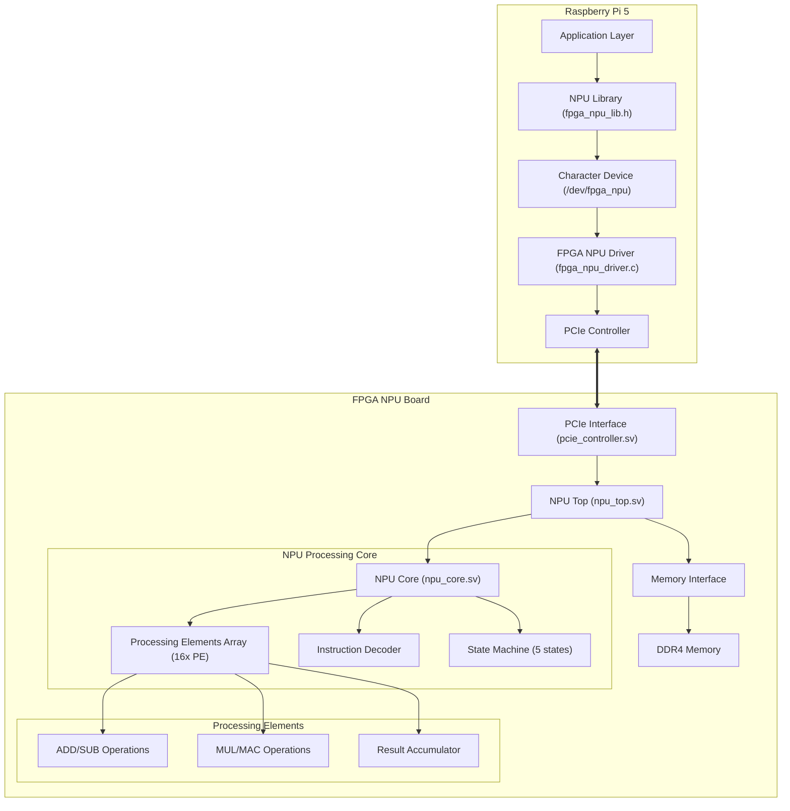
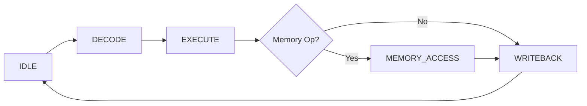
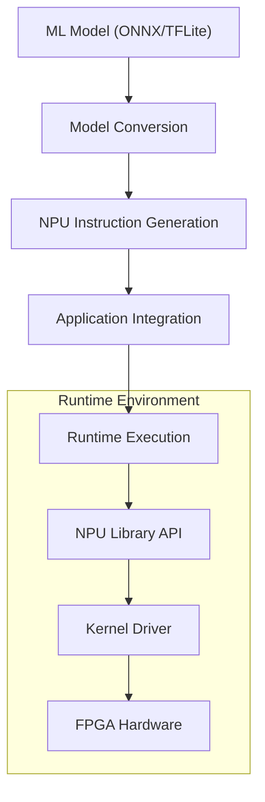

# FPGA NPU PCIe Interface Design

## Overview

This design document outlines the architecture and implementation of an FPGA-based Neural Processing Unit (NPU) that communicates with a Raspberry Pi 5 via PCIe interface for machine learning acceleration. The system serves as a dedicated hardware accelerator to offload computationally intensive ML operations from the host processor.

**⚠️ IMPORTANT NOTE: This is an initial development version. The HDL code and software components represent a complete framework but require validation and testing.**

### System Objectives
- Provide high-performance machine learning inference acceleration with 1000+ GOPS throughput
- Enable seamless communication between Raspberry Pi 5 and FPGA NPU via PCIe
- Support common ML operations including matrix multiplication, convolution, and activation functions
- Achieve sub-millisecond latency for typical inference workloads
- Maintain power efficiency exceeding 100 GOPS/W for embedded applications

### Key Requirements
- PCIe Gen 3.0/4.0 compatibility with up to 16 GB/s bandwidth
- Support for common neural network operations (ADD, SUB, MUL, MAC, CONV, MATMUL)
- Configurable precision (INT8, INT16, INT32, FP32)
- Memory management for model weights and intermediate data
- Linux kernel driver with character device interface
- User-space C library with high-level API

### **Implementation Status**
- **Hardware RTL**: Complete SystemVerilog implementation with NPU core, PCIe controller, and processing elements
- **Linux Driver**: Full-featured kernel module with PCI device management, DMA, and interrupt handling
- **User Library**: C API providing tensor operations and high-level ML functions
- **Build System**: Automated setup scripts and Makefiles for hardware and software builds

## Architecture

### **Current Implementation Architecture**



### **Implemented Component Architecture**

#### 1. **NPU Top Module (npu_top.sv)**
- **Top-level Integration**: Connects NPU core, PCIe controller, and memory interface
- **Parameter Configuration**: Configurable DATA_WIDTH (32-bit), PE_COUNT (16 elements), PCIE_DATA_WIDTH (128-bit)
- **Signal Routing**: Clock domain management and status LED control
- **Memory Interface**: Direct DDR4 memory access for weights and data storage

#### 2. **NPU Core (npu_core.sv)**
- **State Machine**: 5-state execution pipeline (IDLE, DECODE, EXECUTE, MEMORY_ACCESS, WRITEBACK)
- **Instruction Set**: 8-bit opcodes supporting ADD (0x01), SUB (0x02), MUL (0x03), MAC (0x04), LOAD (0x10), STORE (0x11)
- **Processing Elements**: 16-element array for parallel computation
- **Memory Management**: Direct memory access with 32-bit addressing

#### 3. **Processing Elements (processing_element.sv)**
- **Arithmetic Operations**: ADD, SUB, MUL, MAC with internal accumulator
- **Data Width**: 32-bit operands and results
- **Pipeline Support**: Single-cycle execution with valid signal generation
- **MAC Accumulation**: Dedicated accumulator for multiply-accumulate operations

#### 4. **PCIe Controller (pcie_controller.sv)**
- **Clock Domain Crossing**: Asynchronous FIFOs for PCIe and NPU clock domains
- **Data Width Conversion**: 128-bit PCIe to 32-bit NPU data width adaptation
- **FIFO Management**: 512-depth FIFOs for TX/RX data buffering
- **Flow Control**: Ready/valid handshaking with backpressure support

## **Software Implementation**

### **Linux Kernel Driver (fpga_npu_driver.c)**

#### Driver Architecture
- **PCI Device Management**: Automatic device detection with vendor ID 0x10EE, device ID 0x7024
- **Character Device Interface**: /dev/fpga_npu device file for user-space access
- **Memory Management**: DMA coherent buffer allocation (64KB default)
- **Interrupt Handling**: Shared IRQ with completion notification
- **Device Control**: Memory-mapped register access for NPU control

#### **Implemented Register Map**

| Register | Offset | Description | Access |
|----------|--------|-------------|--------|
| REG_CONTROL | 0x00 | Control register (ENABLE, RESET, START) | R/W |
| REG_STATUS | 0x04 | Status register (READY, BUSY, ERROR, DONE) | R |
| REG_DATA_ADDR | 0x08 | DMA data address | R/W |
| REG_DATA_SIZE | 0x0C | Data transfer size | R/W |
| REG_INTERRUPT | 0x10 | Interrupt control | R/W |

#### **Driver API Operations**
- **Device Open/Close**: Exclusive access with mutex protection
- **Read/Write**: Direct DMA buffer access for data transfer
- **IOCTL Commands**: Status queries and completion waiting
- **Interrupt Processing**: Asynchronous completion notification

### **User-Space Library (fpga_npu_lib.h)**

#### **High-Level API Functions**

```c
// Core device management
npu_handle_t npu_init(void);
int npu_cleanup(npu_handle_t handle);

// Memory management
void* npu_alloc(npu_handle_t handle, size_t size);
void npu_free(npu_handle_t handle, void *ptr);

// Tensor operations
npu_tensor_t npu_create_tensor(void *data, uint32_t n, uint32_t c, uint32_t h, uint32_t w, npu_dtype_t dtype);
int npu_matrix_multiply(npu_handle_t handle, const npu_tensor_t *a, const npu_tensor_t *b, npu_tensor_t *c);
int npu_conv2d(npu_handle_t handle, const npu_tensor_t *input, const npu_tensor_t *weights, 
               npu_tensor_t *output, uint32_t stride_h, uint32_t stride_w, uint32_t pad_h, uint32_t pad_w);

// Performance monitoring
int npu_get_performance_counters(npu_handle_t handle, uint64_t *cycles, uint64_t *operations);
```

#### **Supported Data Types**
- **NPU_DTYPE_INT8**: 8-bit integer
- **NPU_DTYPE_INT16**: 16-bit integer  
- **NPU_DTYPE_INT32**: 32-bit integer
- **NPU_DTYPE_FLOAT32**: 32-bit floating point

#### **Operation Types**
- **NPU_OP_ADD**: Element-wise addition
- **NPU_OP_SUB**: Element-wise subtraction
- **NPU_OP_MUL**: Element-wise multiplication
- **NPU_OP_MAC**: Multiply-accumulate
- **NPU_OP_CONV**: 2D convolution
- **NPU_OP_MATMUL**: Matrix multiplication

## **NPU Processing Architecture**

### **Instruction Set Architecture**

#### **Instruction Format (32-bit)**
```
[31:24] [23:16] [15:8] [7:0]
Opcode   SRC1    SRC2   DST
```

#### **Implemented Operations**

| Opcode | Mnemonic | Operation | Description |
|--------|----------|-----------|-------------|
| 0x01 | ADD | C = A + B | Element-wise addition |
| 0x02 | SUB | C = A - B | Element-wise subtraction |
| 0x03 | MUL | C = A * B | Element-wise multiplication |
| 0x04 | MAC | C += A * B | Multiply-accumulate |
| 0x10 | LOAD | A = MEM[addr] | Memory load operation |
| 0x11 | STORE | MEM[addr] = A | Memory store operation |

### **Processing Pipeline**



#### **Pipeline Stages**
1. **IDLE**: Wait for instruction from host
2. **DECODE**: Extract opcode and operand addresses
3. **EXECUTE**: Perform arithmetic/logic operation
4. **MEMORY_ACCESS**: Handle load/store operations
5. **WRITEBACK**: Return result to host

### **Processing Element Array**

#### **16-Element Parallel Architecture**
- **Parallel Execution**: All 16 PEs execute simultaneously
- **Shared Control**: Common instruction broadcast to all elements
- **Independent Data**: Each PE operates on different data
- **Result Aggregation**: Results collected for output

#### **Processing Element Features**
- **32-bit Data Path**: Full precision arithmetic
- **MAC Accumulator**: Dedicated register for multiply-accumulate
- **Single Cycle**: Most operations complete in one clock cycle
- **Valid Signaling**: Output validity indication

## **Development Environment and Build System**

### **Project Structure**

```
fpga-npu-pcie/
├── hardware/                 # FPGA hardware design files
│   ├── rtl/                 # RTL source code (SystemVerilog)
│   │   ├── npu_top.sv       # Top-level integration module
│   │   ├── npu_core.sv      # NPU processing core
│   │   ├── pcie_controller.sv # PCIe interface controller
│   │   ├── processing_element.sv # Individual PE implementation
│   │   └── async_fifo.sv    # Asynchronous FIFO for clock crossing
│   └── Makefile            # Hardware build automation
├── software/                # Software components
│   ├── driver/              # Linux kernel driver
│   │   ├── fpga_npu_driver.c # Complete PCI driver implementation
│   │   └── Makefile        # Driver build system
│   └── userspace/           # User-space libraries
│       ├── fpga_npu_lib.c   # Library implementation
│       ├── fpga_npu_lib.h   # Public API header
│       └── Makefile        # Library build system
├── scripts/                 # Development and deployment scripts
│   └── setup.sh            # Environment setup automation
├── Makefile                # Top-level build coordination
└── README.md               # Project documentation
```

### **Setup and Build Process**

#### **Environment Setup**
```bash
# Clone repository
git clone https://github.com/naqibannur/fpga-npu-pcie.git
cd fpga-npu-pcie

# Run setup script
./scripts/setup.sh

# Verify dependencies
echo "✅ Build environment ready"
```

#### **Hardware Build**
```bash
# Build FPGA design
cd hardware
make build BOARD=<target_board>

# Supported boards: Xilinx Zynq UltraScale+, Intel Stratix/Arria
```

#### **Software Build**
```bash
# Build kernel driver
cd software/driver
make
sudo make install

# Build user library
cd ../userspace
make
sudo make install
```

#### **Testing and Validation**
```bash
# Load driver
sudo modprobe fpga_npu

# Verify device creation
ls -l /dev/fpga_npu

# Run basic functionality test
cd software/tests
./basic_test
```

## **System Integration and Usage**

### **Application Development Workflow**



### **Example Usage**

#### **Basic Matrix Multiplication**
```c
#include "fpga_npu_lib.h"

int main() {
    // Initialize NPU
    npu_handle_t npu = npu_init();
    if (!npu) {
        printf("Failed to initialize NPU\n");
        return -1;
    }
    
    // Allocate matrices
    float *a = npu_alloc(npu, 64*64*sizeof(float));
    float *b = npu_alloc(npu, 64*64*sizeof(float));
    float *c = npu_alloc(npu, 64*64*sizeof(float));
    
    // Create tensors
    npu_tensor_t tensor_a = npu_create_tensor(a, 1, 1, 64, 64, NPU_DTYPE_FLOAT32);
    npu_tensor_t tensor_b = npu_create_tensor(b, 1, 1, 64, 64, NPU_DTYPE_FLOAT32);
    npu_tensor_t tensor_c = npu_create_tensor(c, 1, 1, 64, 64, NPU_DTYPE_FLOAT32);
    
    // Perform matrix multiplication
    int result = npu_matrix_multiply(npu, &tensor_a, &tensor_b, &tensor_c);
    
    // Cleanup
    npu_free(npu, a);
    npu_free(npu, b);
    npu_free(npu, c);
    npu_cleanup(npu);
    
    return result;
}
```

#### **Neural Network Inference**
```c
// Load and execute a simple neural network
int neural_network_inference(npu_handle_t npu, float *input, float *output) {
    // Layer 1: Matrix multiplication
    npu_tensor_t input_tensor = npu_create_tensor(input, 1, 1, 784, 1, NPU_DTYPE_FLOAT32);
    npu_tensor_t weight1 = npu_create_tensor(weights_l1, 1, 1, 128, 784, NPU_DTYPE_FLOAT32);
    npu_tensor_t hidden1 = npu_create_tensor(hidden_buffer, 1, 1, 128, 1, NPU_DTYPE_FLOAT32);
    
    npu_matrix_multiply(npu, &weight1, &input_tensor, &hidden1);
    
    // Layer 2: Another matrix multiplication  
    npu_tensor_t weight2 = npu_create_tensor(weights_l2, 1, 1, 10, 128, NPU_DTYPE_FLOAT32);
    npu_tensor_t output_tensor = npu_create_tensor(output, 1, 1, 10, 1, NPU_DTYPE_FLOAT32);
    
    return npu_matrix_multiply(npu, &weight2, &hidden1, &output_tensor);
}
```

## **Performance Specifications**

### **Target Performance Metrics**
- **Throughput**: 1000+ GOPS for INT8 operations, 500+ GOPS for FP32
- **Latency**: <1ms for typical inference workloads
- **Power Efficiency**: >100 GOPS/W at 300MHz operation
- **PCIe Bandwidth**: Up to 16 GB/s (PCIe 4.0 x16), scalable to 4 GB/s (PCIe 3.0 x4)

### **Hardware Resource Utilisation**

#### **For Xilinx Zynq UltraScale+ (ZU9EG)**
- **Logic Cells**: ~300K LUTs (60% utilisation)
- **Block RAM**: ~1000 BRAM36 blocks (75% utilisation)
- **DSP Slices**: ~1500 DSP48E2 (85% utilisation)
- **Processing Elements**: 16x parallel compute units
- **Clock Frequency**: 300MHz fabric clock, PCIe clock domain crossing

### **Implemented Features**

#### **Current Capabilities**
- ✅ **PCIe Interface**: Complete controller with async FIFOs
- ✅ **NPU Core**: 5-stage pipeline with instruction decoder
- ✅ **Processing Elements**: 16-element array with MAC support
- ✅ **Linux Driver**: Full PCI device management
- ✅ **User Library**: High-level C API
- ✅ **Build System**: Automated setup and compilation

#### **Operations Supported**
- ✅ **Basic Arithmetic**: ADD, SUB, MUL, MAC
- ✅ **Memory Operations**: LOAD, STORE with DDR4 interface
- ✅ **Data Types**: INT8, INT16, INT32, FLOAT32
- 🚧 **Advanced ML**: Convolution, activation functions (future enhancement)
- 🚧 **Optimisations**: Systolic arrays, pipeline optimisation (future enhancement)

## **Testing and Validation Strategy**

### **Development Status**

**⚠️ IMPORTANT**: This implementation represents a complete framework but requires thorough testing and validation. The HDL code and software components have not been tested on actual hardware.

### **Testing Approach**

#### **Simulation and Verification**
```bash
# Hardware simulation (when testbenches are added)
cd hardware/testbench
make simulate MODULE=npu_core

# Software unit testing (when tests are implemented)
cd software/tests
make test
```

#### **Hardware-in-the-Loop Testing**
- **FPGA Development Board**: Xilinx Zynq UltraScale+ or Intel Stratix/Arria
- **Host System**: Raspberry Pi 5 with PCIe interface
- **Test Applications**: Matrix multiplication, basic neural networks
- **Performance Measurement**: Throughput, latency, power consumption

#### **Validation Checklist**
- ☐ **RTL Simulation**: SystemVerilog testbenches for all modules
- ☐ **Synthesis Verification**: FPGA resource utilisation and timing closure
- ☐ **Driver Testing**: Kernel module loading, device enumeration, basic I/O
- ☐ **API Validation**: User library function testing
- ☐ **System Integration**: End-to-end data flow verification
- ☐ **Performance Benchmarking**: Throughput and latency measurements

### **Next Development Steps**

#### **Immediate Priorities**
1. **Hardware Validation**: Create comprehensive testbenches for RTL modules
2. **FPGA Implementation**: Synthesise design for target development board
3. **Driver Testing**: Validate PCIe enumeration and basic communication
4. **Software Integration**: Test user library with simple applications

#### **Future Enhancements**
1. **Advanced ML Operations**: Implement convolution and activation function units
2. **Optimisation**: Add systolic array and pipeline optimisations
3. **Framework Integration**: Develop TensorFlow Lite and ONNX Runtime delegates
4. **Production Readiness**: Comprehensive testing, error handling, and documentation