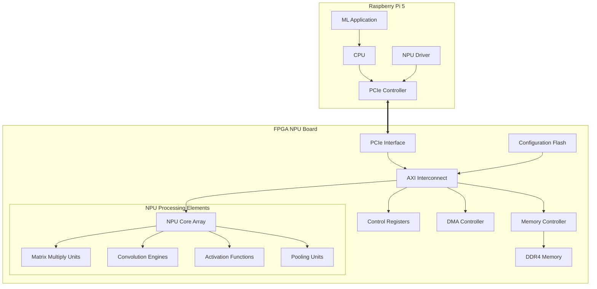
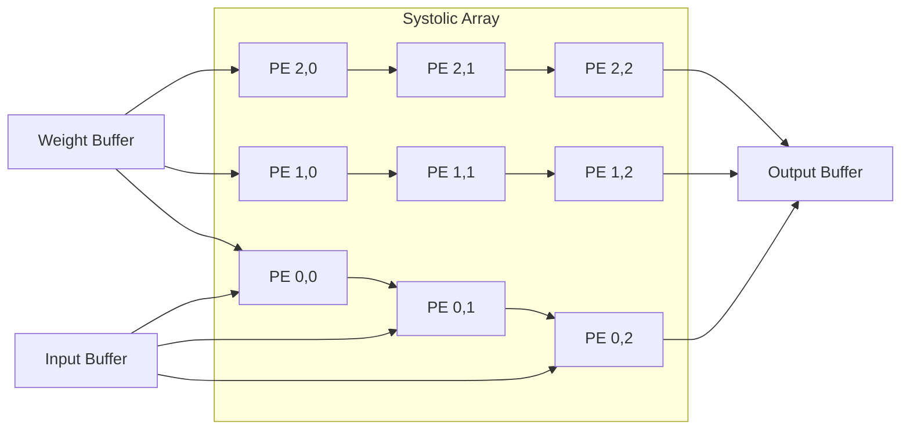
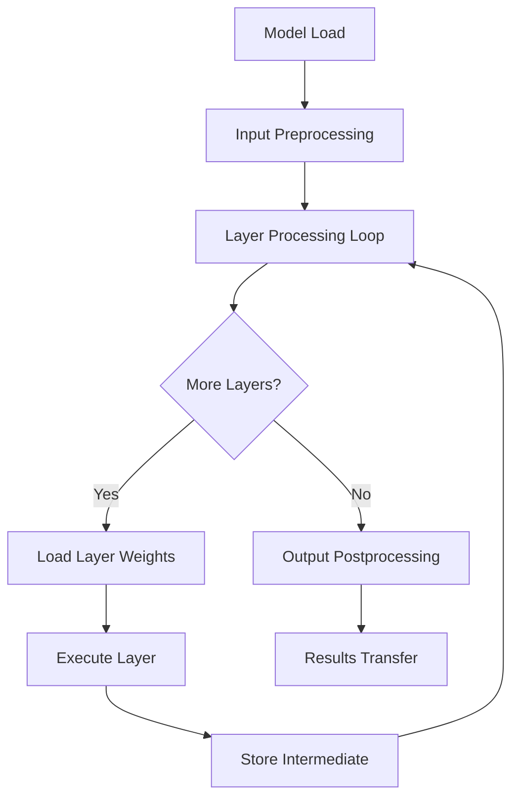

# FPGA NPU PCIe Interface Design

## Overview

This design document outlines the architecture and implementation strategy for an FPGA-based Neural Processing Unit (NPU) that communicates with a Raspberry Pi 5 via PCIe interface for machine learning acceleration. The system serves as a dedicated hardware accelerator to offload computationally intensive ML operations from the host processor.

### System Objectives
- Provide high-performance machine learning inference acceleration
- Enable seamless communication between Raspberry Pi 5 and FPGA NPU via PCIe
- Support common ML operations including matrix multiplication, convolution, and activation functions
- Achieve low latency data transfer and processing
- Maintain power efficiency for embedded applications

### Key Requirements
- PCIe Gen 3.0 compatibility with Raspberry Pi 5
- Support for common neural network layers (Dense, Conv2D, ReLU, etc.)
- Configurable precision (INT8, FP16, FP32)
- Memory management for model weights and intermediate data
- Driver support for Linux-based systems

## Architecture

### System Block Diagram



### Component Architecture

#### 1. PCIe Interface Layer
- **PCIe Endpoint Configuration**: Gen 3.0 x1/x4 lanes
- **Base Address Registers (BARs)**: Memory-mapped register space
- **Interrupt Handling**: MSI/MSI-X support for event notification
- **Power Management**: PCIe power states (D0-D3)

#### 2. AXI Interconnect Infrastructure
- **AXI4 Full Protocol**: High-bandwidth data transfers
- **AXI4-Lite Protocol**: Register access and control
- **AXI4-Stream Protocol**: Streaming data for neural networks
- **Clock Domain Crossing**: PCIe clock to FPGA fabric clock

#### 3. NPU Core Architecture
- **Processing Element Array**: Configurable matrix of compute units
- **Systolic Array Design**: Efficient for matrix operations
- **Pipeline Stages**: Multi-stage processing for throughput optimisation
- **Data Path Width**: 256-bit or 512-bit depending on FPGA resources

## PCIe Interface Specification

### Memory Map

| Address Range | Size | Description |
|---------------|------|-------------|
| 0x0000-0x00FF | 256B | Control and Status Registers |
| 0x0100-0x01FF | 256B | DMA Configuration |
| 0x0200-0x02FF | 256B | NPU Configuration |
| 0x0300-0x03FF | 256B | Performance Counters |
| 0x1000-0x1FFF | 4KB  | Model Metadata Buffer |
| 0x2000-0x7FFF | 24KB | Reserved |

### Control Registers

#### NPU_CTRL (0x0000)
| Bits | Field | Description |
|------|-------|-------------|
| 0 | ENABLE | NPU Enable (1=enabled, 0=disabled) |
| 1 | RESET | Soft reset (1=reset, self-clearing) |
| 2 | INT_EN | Interrupt enable |
| 7-3 | RESERVED | Reserved bits |
| 15-8 | PRECISION | Data precision (00=INT8, 01=FP16, 10=FP32) |
| 31-16 | VERSION | Hardware version |

#### NPU_STATUS (0x0004)
| Bits | Field | Description |
|------|-------|-------------|
| 0 | READY | NPU ready for operation |
| 1 | BUSY | Processing in progress |
| 2 | ERROR | Error condition |
| 3 | INT_PENDING | Interrupt pending |
| 15-4 | RESERVED | Reserved |
| 31-16 | ERROR_CODE | Specific error code |

### DMA Configuration

#### DMA_SRC_ADDR (0x0100-0x0107)
64-bit source address for DMA transfers

#### DMA_DST_ADDR (0x0108-0x010F)
64-bit destination address for DMA transfers

#### DMA_LENGTH (0x0110)
Transfer length in bytes

#### DMA_CTRL (0x0114)
| Bits | Field | Description |
|------|-------|-------------|
| 0 | START | Start DMA transfer |
| 1 | DIR | Direction (0=to FPGA, 1=from FPGA) |
| 2 | INT_EN | Interrupt on completion |
| 31-3 | RESERVED | Reserved |

## NPU Processing Architecture

### Matrix Multiplication Unit (MMU)



#### Processing Element (PE) Design
- **MAC Operation**: Multiply-Accumulate with configurable precision
- **Local Registers**: Input, weight, and partial sum storage
- **Pipeline Depth**: 3-stage pipeline for maximum throughput
- **Dataflow**: Weight stationary with input streaming

### Convolution Engine

#### 2D Convolution Implementation
- **Sliding Window**: Efficient kernel application
- **Padding Support**: Zero, same, and valid padding modes
- **Stride Configuration**: Configurable stride values (1x1 to 4x4)
- **Channel Parallelism**: Multiple input/output channels processed simultaneously

#### Optimisation Features
- **Im2Col Transformation**: Convert convolution to matrix multiplication
- **Winograd Algorithm**: Reduced multiplication complexity for 3x3 kernels
- **Depth-wise Separable**: Efficient implementation for MobileNet architectures

### Activation Function Units

#### Supported Functions
- **ReLU**: Rectified Linear Unit with leak parameter
- **Sigmoid**: Lookup table with interpolation
- **Tanh**: Hyperbolic tangent approximation
- **Softmax**: Exponential normalisation for classification

#### Implementation Strategy
- **Lookup Tables**: Pre-computed values for non-linear functions
- **Piecewise Linear**: Approximation for complex functions
- **Precision Scaling**: Maintain accuracy across different data types

## Memory Architecture

### On-Chip Memory Hierarchy

#### Level 1 Cache (L1)
- **Capacity**: 32KB per processing cluster
- **Organisation**: Direct-mapped, 64-byte cache lines
- **Purpose**: Frequently accessed weights and activations

#### Level 2 Buffer (L2)
- **Capacity**: 512KB shared buffer
- **Organisation**: 4-way set associative
- **Purpose**: Model weights and intermediate feature maps

#### Scratchpad Memory
- **Capacity**: 1MB configurable partitions
- **Purpose**: Temporary storage for layer computations
- **Access Pattern**: Software-managed allocation

### External Memory Interface

#### DDR4 Controller
- **Capacity**: Up to 8GB DDR4-3200
- **Data Width**: 64-bit interface
- **Bandwidth**: 25.6 GB/s theoretical maximum
- **Usage**: Model storage, large feature maps, batch processing

#### Memory Map Layout
| Region | Size | Purpose |
|--------|------|---------|
| 0x00000000-0x0FFFFFFF | 256MB | Model weights and biases |
| 0x10000000-0x1FFFFFFF | 256MB | Input feature maps |
| 0x20000000-0x2FFFFFFF | 256MB | Output feature maps |
| 0x30000000-0x3FFFFFFF | 256MB | Intermediate buffers |
| 0x40000000-0xFFFFFFFF | 3GB | Reserved/Extended storage |

## Data Flow and Processing Pipeline

### Inference Pipeline



### Layer Execution Flow

#### Dense Layer Processing
1. **Weight Loading**: Transfer weights from DDR4 to on-chip buffers
2. **Input Streaming**: Stream input activations through systolic array
3. **Matrix Multiplication**: Compute weighted sums using MMU
4. **Bias Addition**: Add bias terms to results
5. **Activation**: Apply activation function
6. **Output Storage**: Store results for next layer or final output

#### Convolutional Layer Processing
1. **Kernel Loading**: Load convolution kernels to weight buffers
2. **Feature Map Tiling**: Divide input into manageable tiles
3. **Convolution Computation**: Apply kernels using convolution engines
4. **Pooling Operation**: Optional max/average pooling
5. **Activation**: Apply non-linear activation functions
6. **Output Assembly**: Reconstruct full feature maps

### Memory Access Patterns

#### Optimised Data Movement
- **Double Buffering**: Overlap computation with data transfer
- **Prefetching**: Predictive loading of next layer weights
- **Compression**: On-the-fly decompression of compressed models
- **Batching**: Process multiple inputs simultaneously when possible

## Software Interface

### Device Driver Architecture

#### Linux Kernel Module
- **Character Device**: `/dev/fpga_npu` interface
- **IOCTL Commands**: Configuration and control operations
- **Memory Mapping**: Direct access to FPGA memory regions
- **Interrupt Handling**: Asynchronous completion notifications

#### Driver API Functions

```c
// Device initialisation
int npu_init(void);
void npu_cleanup(void);

// Model management
int npu_load_model(const char* model_path);
int npu_unload_model(void);

// Inference operations
int npu_set_input(float* input_data, size_t size);
int npu_run_inference(void);
int npu_get_output(float* output_data, size_t size);

// Configuration
int npu_set_precision(npu_precision_t precision);
int npu_set_batch_size(int batch_size);
```

### User Space Library

#### High-Level API
- **Model Loading**: Support for ONNX, TensorFlow Lite formats
- **Tensor Operations**: Efficient tensor manipulation
- **Error Handling**: Comprehensive error reporting and recovery
- **Performance Monitoring**: Latency and throughput metrics

#### Integration with ML Frameworks
- **TensorFlow Lite**: Custom delegate for FPGA acceleration
- **ONNX Runtime**: Execution provider implementation
- **PyTorch**: Custom backend for model deployment

## Hardware Implementation Details

### FPGA Resource Requirements

#### For Xilinx Zynq UltraScale+ (ZU9EG)
- **Logic Cells**: ~300K LUTs (60% utilisation)
- **Block RAM**: ~1000 BRAM36 blocks (75% utilisation)
- **DSP Slices**: ~1500 DSP48E2 (85% utilisation)
- **PCIe Hard Block**: 1x PCIe Gen3 x4 controller

#### Processing Element Configuration
- **16x16 Systolic Array**: 256 processing elements
- **Clock Frequency**: 300MHz fabric clock
- **Throughput**: 153.6 GOPS (INT8), 76.8 GOPS (FP16)

### Power Management

#### Power Domains
- **PCIe Domain**: Always-on for host communication
- **Processing Domain**: Dynamic scaling based on workload
- **Memory Domain**: Partial power-down for unused banks

#### Dynamic Voltage and Frequency Scaling (DVFS)
- **Performance Mode**: 300MHz, 1.0V core voltage
- **Balanced Mode**: 200MHz, 0.9V core voltage
- **Power Save Mode**: 100MHz, 0.8V core voltage

## Testing Strategy

### Functional Verification

#### Simulation Environment
- **SystemVerilog Testbench**: Comprehensive test scenarios
- **UVM Framework**: Reusable verification components
- **Coverage Metrics**: Code and functional coverage analysis

#### Test Categories
- **PCIe Compliance**: PCIe protocol verification
- **Data Path Testing**: End-to-end data flow validation
- **Error Injection**: Fault tolerance and recovery testing
- **Performance Testing**: Throughput and latency measurements

### Hardware-in-the-Loop Testing

#### Test Setup
- **Raspberry Pi 5**: Host system with test applications
- **FPGA Development Board**: Target hardware platform
- **Logic Analyser**: Signal integrity verification
- **Oscilloscope**: Timing and power analysis

#### Test Scenarios
- **Model Inference**: Complete neural network execution
- **Stress Testing**: Maximum throughput scenarios
- **Thermal Testing**: Extended operation under load
- **EMC Compliance**: Electromagnetic compatibility verification

### Performance Benchmarks

#### Standard ML Models
- **ResNet-50**: Image classification benchmark
- **MobileNet-V2**: Efficient mobile architecture
- **BERT-Base**: Natural language processing
- **YOLOv5**: Object detection workload

#### Metrics
- **Inference Latency**: Time per inference (milliseconds)
- **Throughput**: Inferences per second
- **Power Efficiency**: TOPS per Watt
- **Memory Bandwidth**: Effective memory utilisation